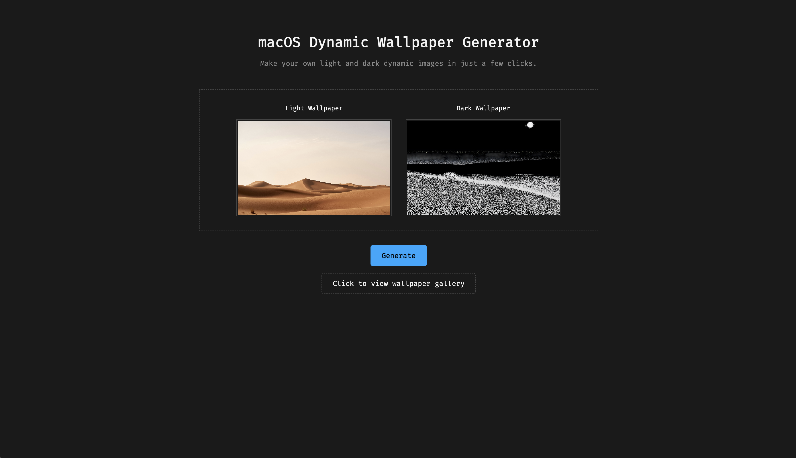

# macOS Dynamic Wallpaper Generator

A web service to create custom light & dark mode dynamic `.heic` wallpapers for macOS, built with Go and containerized with Docker.



---

## What is this?

Creating dynamic wallpapers for macOS that automatically switch between light and dark mode is surprisingly difficult to do manually. This project takes the command-line knowledge required and wraps it in a simple, robust web service.

Upload a light mode image and a dark mode image, and the service will process them into a single `.heic` file that you can set as your wallpaper in macOS System Settings.

This project was also an exercise in building a complete, production-ready application stack from the ground up, incorporating modern DevOps principles and tools.

Most of the know-how for making `.heic` files came form this .


## Features

-   **Simple Web Interface:** Clean, modern UI for uploading light and dark mode images with live previews.
-   **Asynchronous Job Processing:** Uses Redis as a job queue to handle image processing without blocking the user.
-   **Cloud Storage:** All generated wallpapers and previews are stored in a Cloudflare R2 bucket.
-   **Wallpaper Gallery:** A dedicated page to view all previously created wallpapers.
-   **Fully Containerized:** The entire application stack is defined in a `compose.yaml` file for easy local development.
-   **Observability:** A full monitoring stack using Prometheus and Grafana to visualize application and system metrics.
-   **Production-Ready:** Includes a secure Traefik reverse proxy and a complete Infrastructure-as-Code (IaC) setup with Terraform to provision a GCP server.
-   **Automated Deployments:** A GitHub Actions workflow handles secure, automated deployments on every push to `main`.

## The DevOps & Infrastructure Stack

This project is meant to be a showcase of a modern, automated, and observable system.

-   **Infrastructure as Code (IaC):** The entire production server environment—including the VPC network, firewall rules, static IP, and the VM itself—is defined and managed with **Terraform**. This allows for repeatable, version-controlled infrastructure.

-   **Continuous Deployment (CD):** A **GitHub Actions** workflow automatically deploys the application on every push to the `main` branch. It securely connects to the server, pulls the latest code, and orchestrates a zero-downtime restart of the application services.

-   **DNS & SSL Management:** **Cloudflare** manages the project's DNS and provides free, automatic SSL certificates, handling all public-facing HTTPS traffic securely and efficiently.

-   **Full-Stack Observability:** The application is fully instrumented for monitoring.
    -   **Prometheus** scrapes custom application metrics from the Go backend and system metrics from `Node Exporter` and `cAdvisor`.
    -   **Grafana** provides rich, pre-built dashboards to visualize application performance (jobs processed, duration, etc.) and system health (CPU, RAM, container-specific usage) in real-time.

-   **Service Orchestration:** **Docker Compose** is used to define and run the multi-container application stack, both locally and in production.

-   **Reverse Proxy:** **Traefik** acts as a secure, intelligent reverse proxy, automatically discovering services and routing traffic based on hostnames.


## Tech Stack & Architecture

The application is designed as a set of communicating services, orchestrated by Docker Compose.

```
                                  +-----------------------+
-----> User's Browser ----->      |   Traefik             |
                                  |   (Reverse Proxy)     |
                                  +-----------+-----------+
                                              |
                             (Routes to http://app.localhost)
                                              |
                                              v
      +-----------------------------------------------------------------+
      |                           Go Application                        |
      | +-----------------------+                 +-------------------+ |
      | |   API Server (Gin)    |<----------------|  Redis (Job Queue)| |
      | | - Handles uploads     |                 |                   | |
      | | - Serves frontend     |                 +-------------------+ |
      | | - Exposes /metrics    |                                       |
      | +-----------------------+                 +-------------------+ |
      |                                           |  PostgreSQL       | |
      | +-----------------------+                 |  (Database)       | |
      | |   Worker Process      |----------------->| - Stores job info| |
      | | - Processes jobs      |                 | - Wallpaper URLs | |
      | | - Uses exiv2/heif-enc |                 +-------------------+ |
      | | - Uploads to R2       |                                       |
      | +---------+-------------+                                       |
      +-----------|-----------------------------------------------------+
                  | (Uploads .heic & .jpg)
                  v
      +-----------------------+
      |   Cloudflare R2       |
      |   (Object Storage)    |
      +-----------------------+

```

1.  A user navigates to the web app. **Traefik** receives the request and securely routes it to the **Go API Server**.
2.  The user uploads a light and a dark image. The API server creates a "pending" job record in the **PostgreSQL** database and pushes a job ID into the **Redis** queue.
3.  A separate **Go Worker** process, which is constantly listening to Redis, picks up the job.
4.  The Worker executes the image processing pipeline (`exiv2`, `heif-enc`, `imagemagick`) to create the final `.heic` wallpaper and a `.jpg` preview.
5.  Upon completion, the Worker uploads both files to **Cloudflare R2** and updates the job's record in PostgreSQL with the final URLs and a "completed" status.
6.  The user's webpage, which has been polling the API, gets the "completed" status and displays the download link.


The observability stack (`Prometheus`, `Grafana`, `cAdvisor`, `Node Exporter`) runs alongside and monitors the Go application and the host system.

## Running Locally

**Prerequisites:**
-   [Docker](https://www.docker.com/get-started)
-   [Docker Compose](https://docs.docker.com/compose/install/)
-   [Git](https://git-scm.com/)

**1. Clone the repository:**
```bash
git clone git@github.com:cellnine/dynamic_waller.git
cd dynamic_waller
```

**2. Create your environment file:**
Copy the example file to create your own local configuration.
```bash
cp .env.example .env
```

**3. Configure your secrets:**
Open the newly created `.env` file and fill in all the required values for Cloudflare R2 and PostgreSQL.

**4. Build and run the application:**
This single command will build the Go binary, pull all necessary Docker images, and start the entire stack.
```bash
docker-compose up --build
```

**5. Access the services:**
-   **Main Application:** `http://localhost` (or `http://app.localhost`)
-   **Grafana Dashboard:** `http://localhost:3000` (Login: `admin`/`admin`)
-   **Prometheus UI:** `http://localhost:9090`
-   **Traefik Dashboard:** `http://localhost:8081`

## Deployment

This repository is configured for automated deployments to a production server.

-   The infrastructure (a GCP Virtual Machine, VPC, firewall, etc.) is defined in the `/terraform` directory.
-   On every push to the `main` branch, the GitHub Actions workflow defined in `.github/workflows/deploy.yml` triggers.
-   The workflow securely connects to the server via SSH, pulls the latest code, and restarts the Docker Compose stack.
-   All production secrets (R2 keys, database passwords) are stored securely in GitHub Repository Secrets and are injected into the server at deploy time.

---

```
